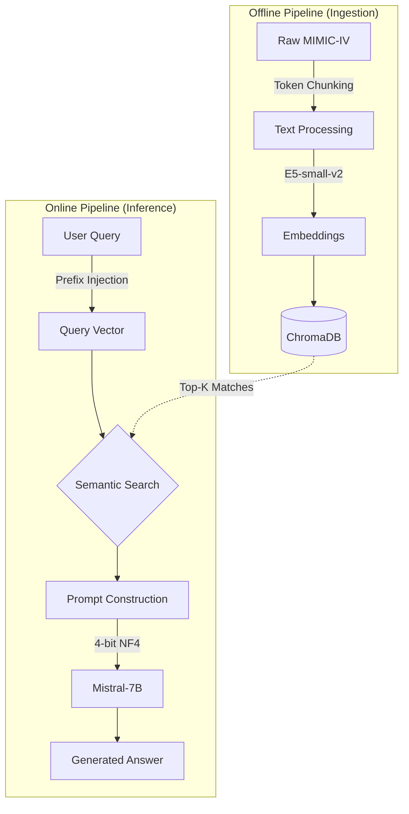

# Clinical RAG Assistant

<p align="center">
  
  
  
  
</p>

<p align="center">
  <strong>A production-ready Retrieval-Augmented Generation (RAG) system for clinical question answering</strong>
</p>

> **DISCLAIMER**: This is a research and educational tool demonstrating RAG architecture for clinical text. It is NOT intended for medical diagnosis, treatment decisions, or patient care. Always consult qualified healthcare professionals for medical advice.

---

## Overview

An end-to-end Retrieval-Augmented Generation (RAG) application showcasing modern techniques for semantic search and context-aware generation within the clinical domain. The system is built with production-grade components and deployed as an interactive web application, focusing on memory efficiency and high-accuracy retrieval.

**Technical Stack:**
*   **Embedding Model:** E5-small-v2 (384-dim) for semantic search
*   **Vector Storage:** ChromaDB with 934 indexed clinical documents
*   **Generation Model:** Mistral-7B-Instruct (4-bit quantized) for natural language generation
*   **Application Framework:** Streamlit for the interactive web interface
*   **Dataset:** MIMIC-IV-EXT (511 clinical notes across 25 disease categories)

### Key Technical Features

*   **Semantic Search Engine:** Utilizes E5 embeddings with cosine similarity retrieval.
*   **Efficient Vector Storage:** ChromaDB implementation with optimized indexing, achieving ~14ms query latency.
*   **Memory-Optimized LLM:** 4-bit NormalFloat (NF4) quantization via BitsAndBytes reduces GPU memory footprint to ~4GB, enabling deployment on consumer-grade hardware.
*   **Production Web Interface:** Streamlit application providing real-time processing and result visualization.
*   **Comprehensive Auditing:** Built-in tracking for performance metrics and explicit source attribution for all generated claims.

---

## Quick Start

### Prerequisites

*   Python 3.10+
*   CUDA 11.8+ (for GPU acceleration)
*   ~6.5 GB GPU memory (Tesla T4, V100, or RTX 3090)
*   Google Drive access (for downloading pre-processed data)

### Installation

```bash
# 1. Clone the repository
git clone https://github.com/muhammadhoud/NLP-Clinical-RAG.git
cd clinical-rag-assistant

# 2. Install dependencies
pip install -r requirements.txt

# 3. Download pre-processed data
# See data/README.md for the Google Drive link
# Extract chroma_db.zip to the data/ directory

# 4. Run the application
streamlit run app.py
```

**Access the Application:** `http://localhost:8501`

---

## System Architecture

The architecture is divided into an offline data ingestion pipeline and an online inference pipeline. The diagram below utilizes a compact left-to-right flow to illustrate the technical execution strategy clearly.



---

## Dataset

### MIMIC-IV-EXT-DIRECT-1.0.0

*   **Source:** PhysioNet (credentialed access required)
*   **License:** PhysioNet Credentialed Health Data License
*   **Scale:** 511 raw notes processed into 934 vector chunks (400-token segments, 100-token overlap).

### Disease Coverage (Top Categories)

| Category | Documents | Category | Documents |
|----------|-----------|----------|-----------|
| Acute Coronary Syndrome | 134 | Pneumonia | 39 |
| Heart Failure | 107 | Hypertension | 43 |
| Stroke | 67 | COPD | 36 |
| Gastritis | 58 | Diabetes | 26 |
| Pulmonary Embolism | 58 | Asthma | 25 |

---

## Performance Benchmarks

### Retrieval Metrics
| Metric | Value | Description |
|--------|-------|-------------|
| **Precision@5** | 0.41 | Relevant documents in top 5 |
| **Recall@5** | 1.79 | Coverage of relevant documents |
| **MRR** | 0.60 | Mean reciprocal rank |
| **Query Latency** | 14.35 ms | Average vector retrieval time |
| **Throughput** | 69.7 q/sec | System capacity |

### Generation Metrics
| Metric | Value | Notes |
|--------|-------|-------|
| **ROUGE-L** | 0.114 | Lexical overlap with reference texts |
| **Term Coverage** | 78.75% | Presence of expected medical terminology |
| **Source Attribution** | 90.00% | Responses explicitly citing retrieved documents |

*Note: The ROUGE-L score is typical for medical QA, where generated answers often provide valid, clinically accurate explanations that utilize different vocabulary than the strict reference text.*

### Resource Utilization
| Resource | Requirement |
|----------|-------------|
| **GPU Memory** | ~6.5 GB (peak) |
| **RAM** | 8 GB minimum |
| **Storage** | ~500 MB (data + model weights) |
| **End-to-End Latency**| ~5-10 seconds per query |

---

## Application Features

1.  **Interactive Query Interface:** Natural language input with adjustable retrieval parameters (1-10 sources) and real-time processing indicators.
2.  **Semantic Search Display:** Ranked documents with similarity scores, disease category tags, and expandable text previews.
3.  **Context-Aware Generation:** Model outputs grounded strictly in retrieved context, featuring source citations and preservation of medical terminology.
4.  **Targeted Filtering:** Domain-specific search refinement allowing users to isolate queries to specific disease categories.
5.  **Performance Monitoring:** Real-time tracking of query latency, retrieval vs. generation time breakdowns, and memory utilization.

---

## Configuration

Core parameters can be modified in `config.py`:

```python
EMBEDDING_CONFIG = {
    'model_name': 'intfloat/e5-small-v2',
    'embedding_dim': 384,
    'query_prefix': 'query: '
}

GENERATION_CONFIG = {
    'model_name': 'mistralai/Mistral-7B-Instruct-v0.2',
    'quantization': '4bit-nf4',
    'max_new_tokens': 512,
    'temperature': 0.7,
    'top_p': 0.9
}

RETRIEVAL_CONFIG = {
    'default_top_k': 5,
    'max_context_tokens': 2000,
    'similarity_threshold': 0.5
}
```

---

## Deployment

### Streamlit Cloud
1. Fork the repository.
2. Connect to share.streamlit.io.
3. Configure API secrets if applicable.
4. Deploy using `app.py` as the entry point. *(Note: GPU availability is limited on the free tier).*

### Docker
```dockerfile
FROM python:3.10-slim
WORKDIR /app
COPY requirements.txt .
RUN pip install --no-cache-dir -r requirements.txt
COPY . .
EXPOSE 8501
CMD ["streamlit", "run", "app.py", "--server.port=8501"]
```

```bash
docker build -t clinical-rag .
docker run -p 8501:8501 --gpus all clinical-rag
```

---

## Important Disclaimers

**Medical Use Limitation:** This application is strictly for research and educational purposes. It must not be used for medical diagnosis, treatment recommendations, clinical decision-making, or patient care.

**Data Privacy:** The MIMIC-IV-EXT dataset contains de-identified clinical notes. Users must comply with PhysioNet's data use agreements and relevant privacy regulations (e.g., HIPAA) when handling this data.

---

## Contact & Author Details

**Muhammad Houd**
*   **Email:** mhoud131@gmail.com
*   **LinkedIn:** [Muhammad Houd](https://www.linkedin.com/in/muhammadhoud/)
*   **GitHub:** [@muhammadhoud](https://github.com/muhammadhoud)

For questions regarding RAG architecture, clinical NLP implementations, or deployment strategies, please open an issue or reach out via email.
